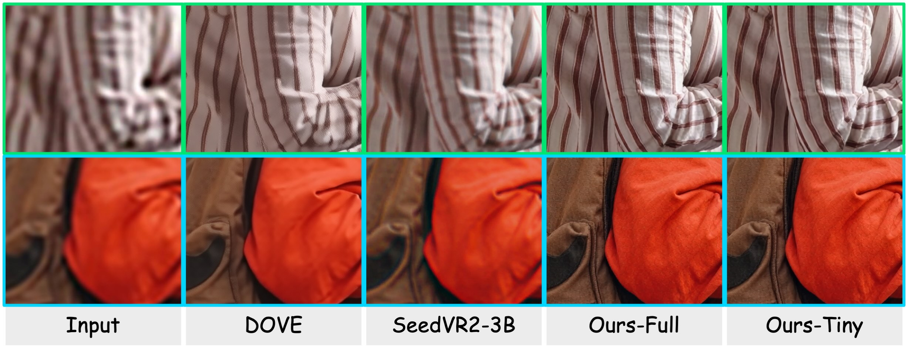

# ⚡ FlashVSR Stable

**Optimized inference pipeline based on [FlashVSR](https://github.com/OpenImagingLab/FlashVSR) project**

**Authors:** Junhao Zhuang, Shi Guo, Xin Cai, Xiaohui Li, Yihao Liu, Chun Yuan, Tianfan Xue

**Modified:** naxci1  

<a href='http://zhuang2002.github.io/FlashVSR'></a> &nbsp;
<a href="https://huggingface.co/JunhaoZhuang/FlashVSR"></a> &nbsp;
<a href="https://huggingface.co/datasets/JunhaoZhuang/VSR-120K"></a> &nbsp;
<a href="https://arxiv.org/abs/2510.12747"></a>

**Your star means a lot for us to develop this project!** :star:



---
### 🤔 What's New?

- Replaced `Block-Sparse-Attention` with `Sparse_SageAttention` to avoid building complex cuda kernels.  
- With the new `tile_dit` method, you can even output 1080P video on 8GB of VRAM.   
- Support copying audio tracks to output files (powered by FFmpeg). 
- Introduced Blackwell GPU support for FlashVSR.
- Optimized for Nvidia 40x and 50x (tested with 16 GB VRAM)
- Batch processing mode added, splitting larger files into chunks for more stable execution.
- All bugs fixed, and most OOM errors resolved.
- A 1-minute 15 fps video (900 frames) runs without batch processing.

---
### 🚀 Getting Started

Follow these steps to set up and run **FlashVSR** on your local machine:

> ⚠️ **Note:** This project is primarily designed and optimized for **4× video super-resolution**.  
> We **strongly recommend** using the **4× SR setting** to achieve better results and stability. ✅

#### 1️⃣ Clone the Repository

```bash
git clone https://github.com/naxci1/FlashVSR_Stable
cd FlashVSR_Stable
````

#### 2️⃣ Set Up the Python Environment

Create and activate the environment:

```bash
conda create -n flashvsr
conda activate flashvsr
```

Install project dependencies:

```bash
# for CUDA 12.8
pip install -r requirements.txt --index-url https://download.pytorch.org/whl/cu128

# for CUDA 13.0
pip install -r requirements.txt --index-url https://download.pytorch.org/whl/cu130
```

#### 3️⃣ Download Model Weights

- When you run FlashVSR+ for the first time, it will automatically download all required models from HuggingFace.  

- You can also manually download all files from [FlashVSR](https://huggingface.co/JunhaoZhuang/FlashVSR) and put them in the following location:  

```
./models/FlashVSR/
│
├── LQ_proj_in.ckpt                                   
├── TCDecoder.ckpt                                    
├── Wan2.1_VAE.pth                                    
├── diffusion_pytorch_model_streaming_dmd.safetensors 
└── README.md
```  

#### 4️⃣ Run Inference

CLI example:

```bash
python run.py -i "C:\video\input" -o "C:\video\output" -s 4 -m full --tiled-vae --tiled-dit --tile-size 256 --overlap 24 --color-fix -t bf16 --batch-size 100

python run.py -i "C:\video\input" -o "C:\video\output" -s 2 -m full --tiled-vae --tiled-dit --tile-size 256 --overlap 24 --color-fix -t bf16  --batch-size 30 

python run.py -i "C:\video\input" -o "C:\video\output" -s 2 -m full --tiled-vae --tiled-dit --tile-size 368 --overlap 24 --color-fix -t bf16  --batch-size 200

python run.py -i "C:\video\input\split" -o "C:\video\output" -s 4 -m full --tiled-vae --tiled-dit --tile-size 256 --overlap 24 --color-fix -t bf16 --max-frames 100 --batch-size 100

python run.py -i "C:\video\input\split" -o "C:\video\output" -s 4 -m full --tiled-vae --tiled-dit --tile-size 128 --overlap 24 --color-fix -t bf16

```

---

# 🧠 FlashVSR Stable Commandline Usage

## Usage

```bash
python run.py [-h]
   -i INPUT
   -o OUTPUT_FOLDER
   [-s SCALE]
   [-m {tiny,tiny-long,full}]
   [--tiled-vae]
   [--tiled-dit]
   [--tile-size TILE_SIZE]
   [--overlap OVERLAP]
   [--unload-dit]
   [--color-fix]
   [--seed SEED]
   [-t {fp16,bf16}]
   [-d DEVICE]
   [-f FPS]
   [--qp QP]
   [-a {sage,block}]
   [--max-frames MAX_FRAMES]
   [--batch-size BATCH_SIZE]
```

---

## Options

| Argument | Description |
|-----------|--------------|
| `-h, --help` | Show this help message and exit |
| `-i, --input` | **Path to input video file** or folder of images/videos *(required)* |
| `-o, --output_folder` | **Path to save processed output video(s)** *(required)* |
| `-s, --scale` | Upscale factor (default: **4**) |
| `-m, --mode` | Processing mode: `{tiny, tiny-long, full}` (default: **tiny**) |
| `--tiled-vae` | Enable **tiled VAE decoding** to reduce VRAM usage |
| `--tiled-dit` | Enable **tiled DiT inference** for high-resolution videos |
| `--tile-size TILE_SIZE` | Tile size for tiled inference (default: **256**) |
| `--overlap OVERLAP` | Overlap size between tiles (default: **24**) |
| `--unload-dit` | Unload DiT before decoding to save VRAM |
| `--color-fix` | Apply color correction to the final video output |
| `--seed` | Random seed for reproducibility (default: **0**) |
| `-t, --dtype` | Data precision: `{fp16, bf16}` (default: **bf16**) |
| `-d, --device` | Compute device (e.g. `'cuda'`, `'cuda:0'`, `'mps'`, `'cpu'`) |
| `-f, --fps` | Output FPS for image sequences (default: **30**) |
| `--qp` | Quantization Parameter for AV1 encoder (0–51, lower = higher quality, default: **13**) |
| `-a, --attention` | Attention mechanism: `{sage, block}` (default: **sage**) |
| `--max-frames` | Limit maximum number of frames to process from the start |
| `--batch-size` | Process the video in chunks of this many frames |

---


### 🤗 Feedback & Support

We welcome feedback and issues. Thank you for trying **FlashVSR Stable**


